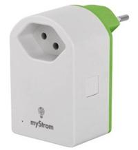
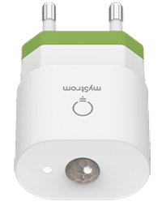
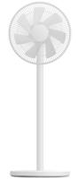
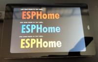
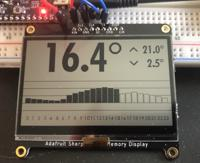

## Making devices run ESPHome

Only projects from sponsored deevcies will be published. If you have a special need for a component or a device that should be made ESPHome compatible feel free to make a donation or sponsor a device through the sponsor links at the right.

So far only one device has been sponsored and therefor published:

### Sponsored devices/components

#### [Swisscom Smart Switch](devices/swisscom_lcs1/)

    Sponsor:  Patrick Frey, Switzerland

### Unsponsored devices

|Picture |Device |Chip used |
|--------|-------|----------|
||myStrom WLAN | ESP32 |
||myStrom Motion | ESP32 |
||Mi Smart Standing Fan 1C | ESP8266 |

### Unsponsored components

|Picture |Device |Chip used |
|--------|-------|----------|
||WT32-SC01 | ESP32/ST7796S/FT6336 |
||Sharp Memory Display | LS013 |
