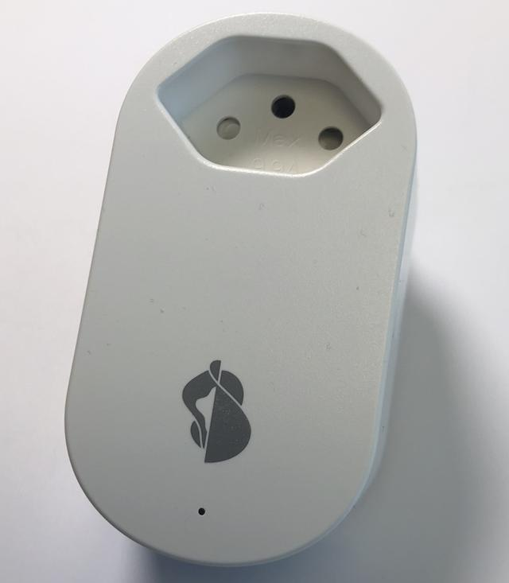
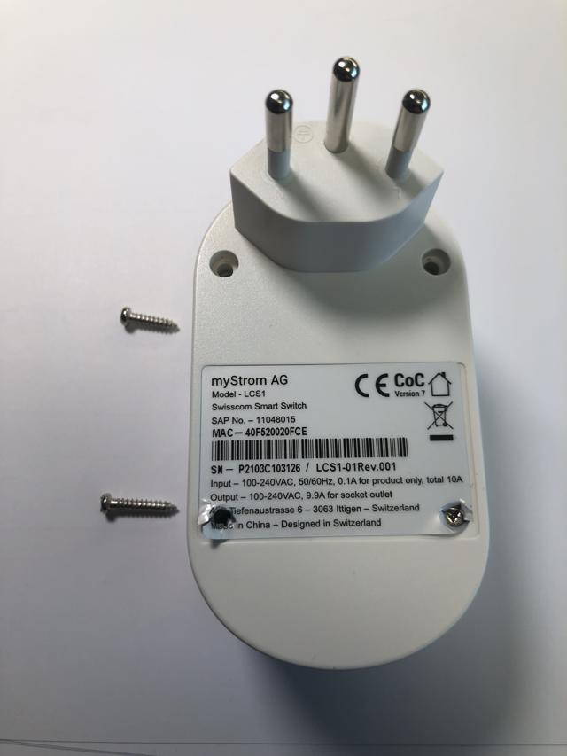
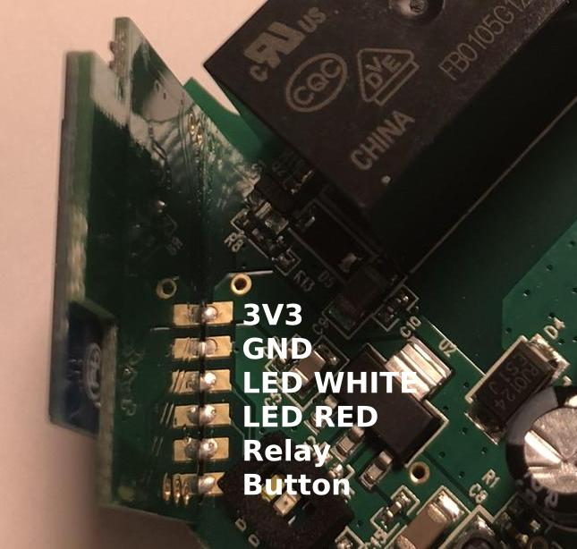

## Swisscom LCS1 Smart Switch

The Swisscom Smart Switch can be thought of as the little brother to the myStrom WLAN Switch which uses an ESP32 chip.
But instead of the ESP32 soldered chip the Swisscom Smart Switch uses an ESP-WROOM-02D module and has no temperature sensor and no circuit for measuring the power consumption.

### Open the case

For opening the case it is best to use a Torx T10 screw driver where three edges have been grinded off to match the triangle shape of the screws. When putting it back together remember that the longer screws are at the bottom of the WLAN switch:

### Main PCB

The main PCB contains the pwoer supply curcuit for delivering 5V for the relay and 3V3 for the ESP-WROMM-02D module. Also soldered is a push button at the side and two small LEDs (red/white) at the bottom of the PCB. The ESP_WROOM-02D module itself is soldered onto a small PCB which then is soldered through a slot onto the main PCB.

The pinout looks like:

    3V3
    GND
    LED white
    LED red
    Relay
    Psuh button

